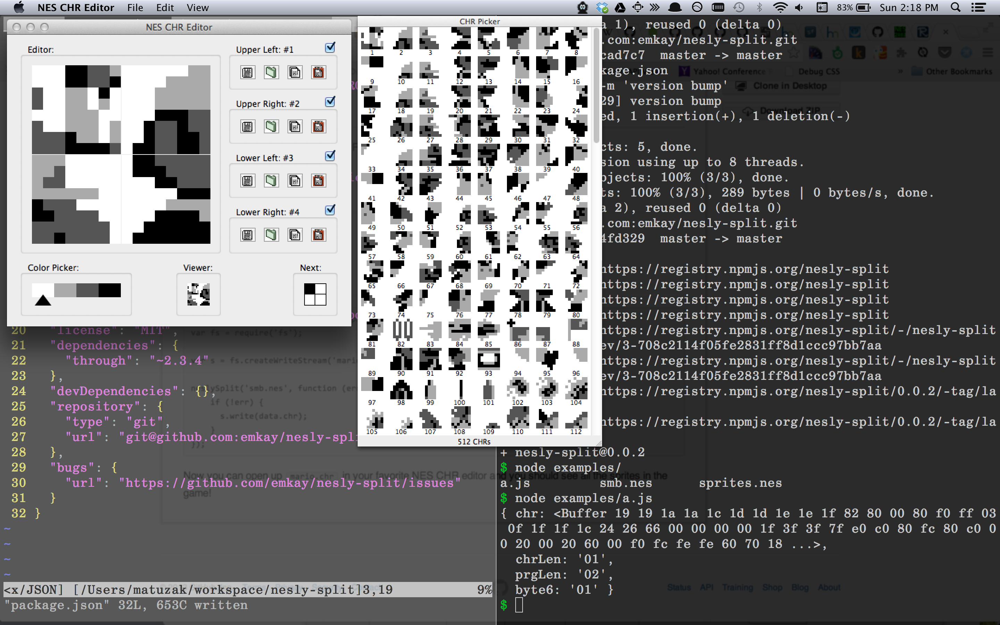

The last couple of weeks I have been working on some programs to do crazy stuff
with a [Nintendo Entertainment
System](https://en.wikipedia.org/wiki/Nintendo_Entertainment_System). The first
module I'd like to show off is
[nesly-split](https://github.com/emkay/nesly-split).

## What does this do?
This module will let you take a NES [ROM
file](https://en.wikipedia.org/wiki/ROM_image) and split out the CHR and PRG.
The CHR is usually where the sprites are located, and the PRG is the program
data that holds the actual code for the game. Sometimes games will hold
everything including sprites in the PRG.

Right now [nesly-split](https://github.com/emkay/nesly-split) only supports
games that hold their sprites in CHR, but the plan is to support ROMs that also hold sprite data in PRG.

## Example
The api is pretty simple. Just pass in a rom file and a callback.

### NES CHR Editor
Now you can open this `data.chr` file with a program like [NES CHR
Editor](http://www.romhacking.net/utilities/460/).

### Sprite Sheet
Holy cow!!! That's the entire sprite sheet for [Super Mario
Bros](https://en.wikipedia.org/wiki/Super_Mario_Bros.). The idea here is to
provide a tool to allow you to take an old school video game, rip out the sprite
sheet, and hack stuff up.

## The Future
I have a lot more planned with this module and some others that are in the
works. Stuff that is on the list is:

* A browser based CHR editor
* A programming language and compiler for NES games
* Somehow rip sprites out of PRG (looking at you Mega Man)
* Real 8-bit NES sound with javascript!!!

Once some more of these tools are in place it will be a little bit easier to
build awesome home brew NES programs.

For a preview take a look at [nesly](https://github.com/emkay/nesly).
